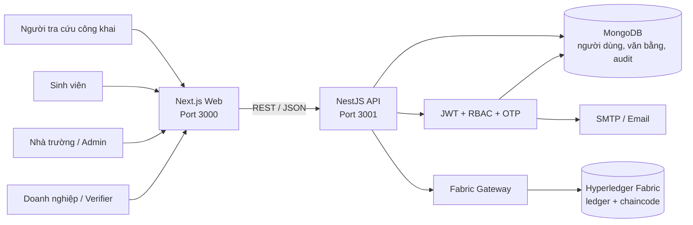

# Kiến trúc hệ thống

## Ranh giới tin cậy

- Frontend không được kết nối trực tiếp MongoDB hoặc Fabric.
- Backend là điểm thực thi xác thực đầu vào, phân quyền, rate limit và audit.
- MongoDB lưu dữ liệu nghiệp vụ có thể truy vấn; Fabric lưu hash, trạng thái và bằng chứng bất biến.
- Kết quả xác thực phải đối chiếu dữ liệu đầu vào, MongoDB và blockchain.

